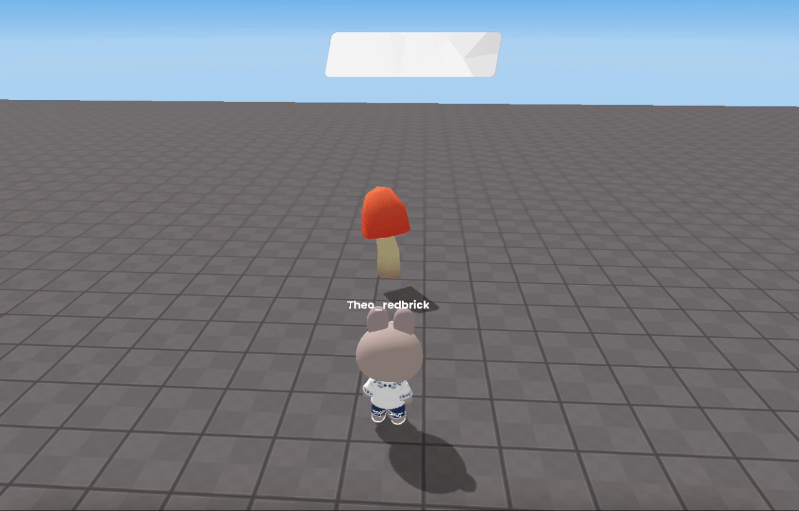
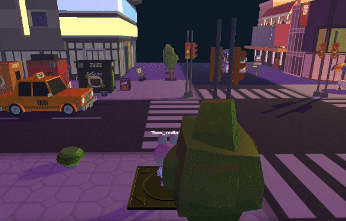
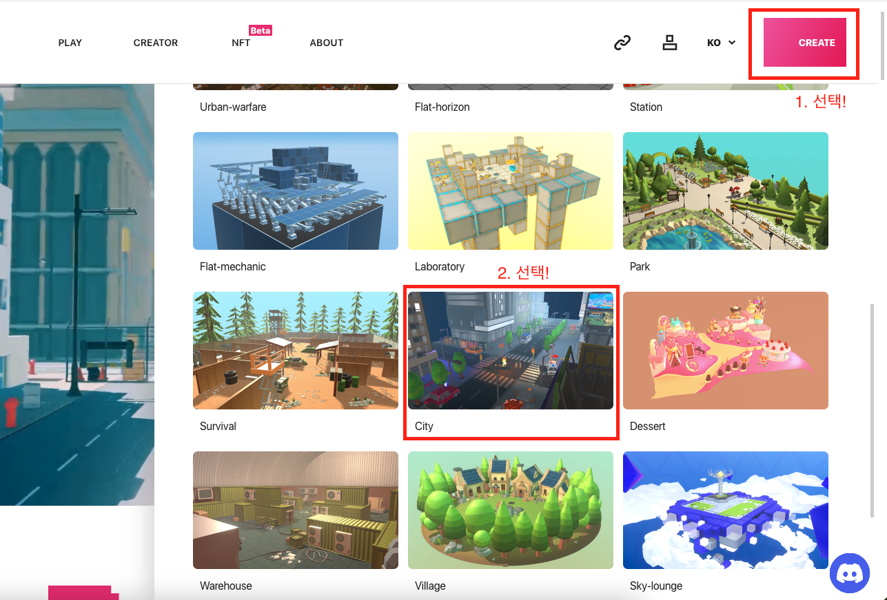
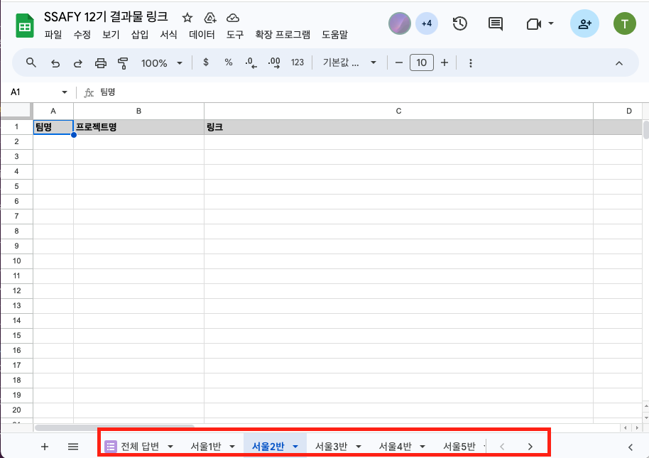

import { Callout, Steps, Cards } from "nextra/components";

# 📝 학습 자료

수업에 사용될 학습 자료들입니다.  

오리엔테이션 PPT : 👉 [보러가기](https://docs.google.com/presentation/d/1oh9KT-vDGiLvA6NQ6-iGCM4fd81THDdo/edit?usp=drive_link&ouid=101146029283142124721&rtpof=true&sd=true)

## 기본 프로그래밍 알아보기

레드브릭 스튜디오를 다루는 기본적인 방법들을 알아보아요.  

### 오브젝트 움직이기

 

학습 PPT : 👉 [보러가기](https://docs.google.com/presentation/d/1YvZbIKJEx0GOpa3mSWY5PnQ9EkxoDxgvyeSAMS5iWdg/edit?usp=drive_link)

### 오브젝트와 상호 작용하기

 

학습 PPT : 👉 [보러가기](https://docs.google.com/presentation/d/1IE1RQIPEdHcH7oDyapdqcgXQbRFl2uQM3JbJP6k-Krs/edit?usp=drive_link)

### 점수 구현하기

 

학습 PPT : 👉 [보러가기](https://docs.google.com/presentation/d/1BODhkvgiMVzEHsiUuTFz-TUg0UF_G3UQ4jg1QUrVtE8/edit?usp=drive_link)

## 따라해 볼까요?

### 어서와요, SSAFY CITY

 

학습 PPT : 👉 [보러가기](https://docs.google.com/presentation/d/1sDxb0fUuQ9ANj2d8K93YlsvD8j5AHqVazH4j0puYs8c/edit?usp=drive_link)  

  

템플릿 : 👉 [Redbrick Creator Land](https://creator.redbrick.land) > CREATE > City 템플릿을 활용하세요.

### 함께해요, 디저트 월드 

 

학습 PPT : 👉 [보러가기](https://docs.google.com/presentation/d/1KAwE72dKlls0B_J21JbPubOZaPc_694qVF6iWW3YsBA/edit?usp=drive_link)  

  

템플릿 : 👉 [Redbrick Creator Land](https://creator.redbrick.land) > CREATE > Dessert 템플릿을 활용하세요.

## 결과물 제출

<Callout icon=":D">
완성된 결과물은 👉[이곳]()👈 에서 제출해주세요!
</Callout>

## 우리 반의 결과물 확인하기

<Callout icon=":D">
    제출된 결과물을 확인하려면 👉[이곳]()👈으로 들어가신 뒤, 엑셀의 하단 탭에서 본인의 반을 선택해주세요.  
</Callout>

{/* 이미지 교체 필요 */}
 

## SSAFY 13기 설문조사 (교육생용)

오늘의 교육은 만족스러우셨나요?  
<Callout icon=":D">
👉[이곳]()👈 에서 설문조사를 진행해 주세요!
</Callout>