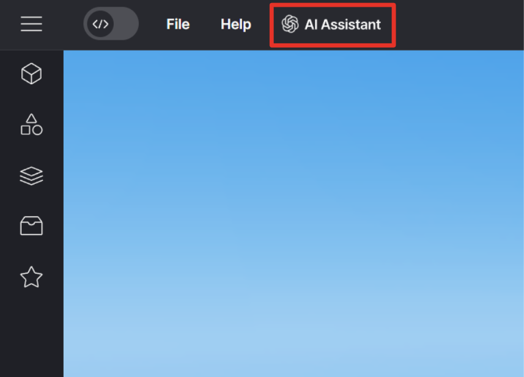
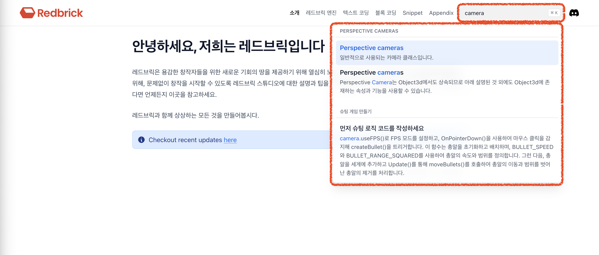
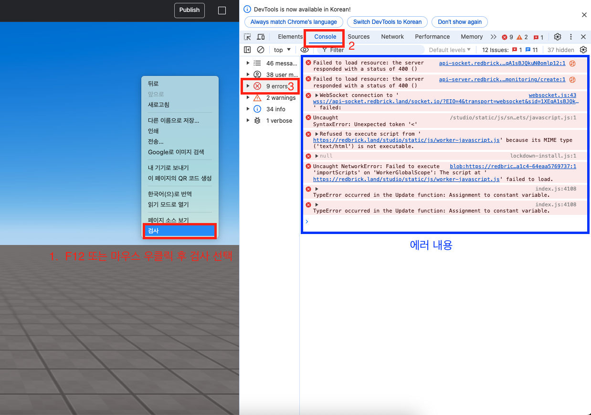
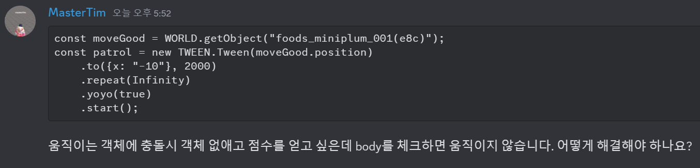
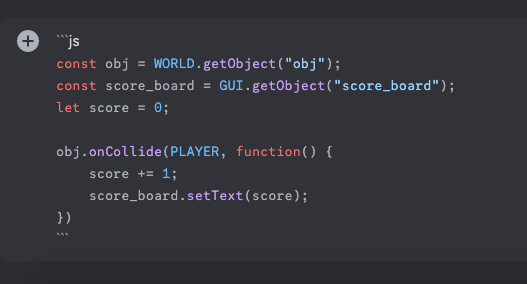
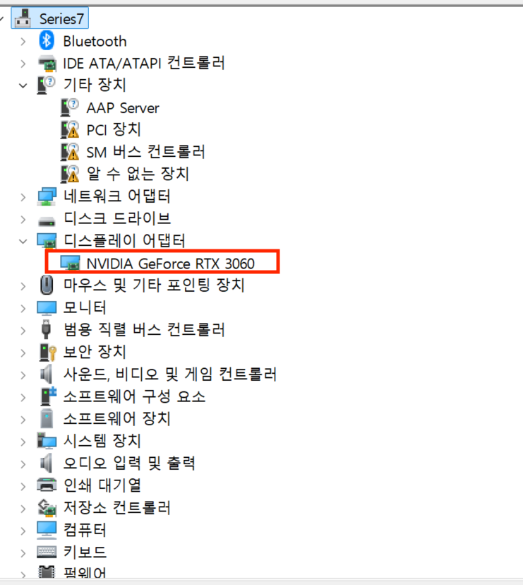

import { Callout, Steps, Cards } from "nextra/components";
import { YouTube } from "mdx-embed";

# SSAFY 13기 디스코드 질문 매뉴얼

안녕하세요 레드브릭 디스코드 대응팀입니다. 13기 학생 여러분, 아래 내용을 충분히 읽어보시면 원활한 프로젝트 수행에 도움이 될 것입니다.

## ✅ 체크사항

- 원활한 질의응답을 위해 **팀에서 1명만** 디스코드 채널에 입장해 주세요.
- 스튜디오 플랫폼 가입 및 로그인을 해주세요. **Click** > [Redbrick Creator Land](https://creator.redbrick.land/)
- 레드브릭 디스코드 가입 및 로그인을 해주신 후, 채널에 입장해주세요. **Click** > [Discord Channel](https://discord.com/invite/redbrick-create)

## 📌 질문하기 전에 확인해주세요!

<Steps>

### 🤖 코드가 작동하지 않을 때는 AI Assistant를 적극 활용해주세요

<Callout type="info">

- 유튜브 영상 보러 가기 Click > [Redbrick's AI Assistant 🤖🚀🔥](https://www.youtube.com/watch?v=j6z4vIZskpg)

 Redbrick's AI Assistant

- 잘 질문하는 꿀Tip! Click > [AI Assistant (GPT)을 올바르게 사용하는 방법](../faq/ai-assistant)

</Callout>
 
<YouTube youTubeId="j6z4vIZskpg" />

### 📖 레드브릭 스튜디오 Wiki는 확인했나요?

<Callout type="info">

- Wiki 보러 가기 Click > [Redbick Wiki](../)

- 검색창에 키워드로 검색해주세요.

 Wiki search

</Callout>

### 👋 내가 하는 고민은 다른 사람도 했다! 자주 하는 질문에 있는지 찾아보세요!

<Cards>
  <Cards.Card
    icon={
      <svg
        xmlns="http://www.w3.org/2000/svg"
        fill="none"
        viewBox="0 0 24 24"
        strokeWidth="1.5"
        stroke="currentColor"
      >
        <path
          stroke-linecap="round"
          stroke-linejoin="round"
          d="M12 9v3.75m-9.303 3.376c-.866 1.5.217 3.374 1.948 3.374h14.71c1.73 0 2.813-1.874 1.948-3.374L13.949 3.378c-.866-1.5-3.032-1.5-3.898 0L2.697 16.126zM12 15.75h.007v.008H12v-.008z"
        />
      </svg>
    }
    title="자주하는 질문 FAQ"
    href="../faq/questions"
  />
</Cards>

### 💃 예제 게임에 있는 스니펫을 그대로 쓰고 싶다면?

<Callout type="info">
  🫶🏻 스니펫을 모은 스니펫 월드 파일을 공유드립니다.
</Callout>

<Cards>
  <Cards.Card
    icon={
      <svg
        xmlns="http://www.w3.org/2000/svg"
        fill="none"
        viewBox="0 0 24 24"
        strokeWidth="1.5"
        stroke="currentColor"
      >
        <path
          stroke-linecap="round"
          stroke-linejoin="round"
          d="M19.5 14.25v-2.625a3.375 3.375 0 00-3.375-3.375h-1.5A1.125 1.125 0 0113.5 7.125v-1.5a3.375 3.375 0 00-3.375-3.375H8.25m0 12.75h7.5m-7.5 3H12M10.5 2.25H5.625c-.621 0-1.125.504-1.125 1.125v17.25c0 .621.504 1.125 1.125 1.125h12.75c.621 0 1.125-.504 1.125-1.125V11.25a9 9 0 00-9-9z"
        />
      </svg>
    }
    title="스니펫 월드 사용방법 🙋🏻"
    href="./snippet-world"
  />
</Cards>

### 🙅‍♂️ 레드브릭 스튜디오는 이 기능은 지원하지 않아요!

<Cards>
  <Cards.Card
    icon={
      <svg
        xmlns="http://www.w3.org/2000/svg"
        fill="none"
        viewBox="0 0 24 24"
        strokeWidth="1.5"
        stroke="currentColor"
      >
        <path
          stroke-linecap="round"
          stroke-linejoin="round"
          d="M4.5 12a7.5 7.5 0 0015 0m-15 0a7.5 7.5 0 1115 0m-15 0H3m16.5 0H21m-1.5 0H12m-8.457 3.077l1.41-.513m14.095-5.13l1.41-.513M5.106 17.785l1.15-.964m11.49-9.642l1.149-.964M7.501 19.795l.75-1.3m7.5-12.99l.75-1.3m-6.063 16.658l.26-1.477m2.605-14.772l.26-1.477m0 17.726l-.26-1.477M10.698 4.614l-.26-1.477M16.5 19.794l-.75-1.299M7.5 4.205L12 12m6.894 5.785l-1.149-.964M6.256 7.178l-1.15-.964m15.352 8.864l-1.41-.513M4.954 9.435l-1.41-.514M12.002 12l-3.75 6.495"
        />
      </svg>
    }
    title="지원되지 않는 기능들"
    href="../faq/not-supported-features"
  />
</Cards>

### ❌ 에러 발생시 확인하는 법

에러의 내용은 팝업으로 표시되거나, 콘솔창에 표시됩니다.  
❗️콘솔창 확인하는 법 : F12 또는 브라우저 화면에서 우클릭후 검사 선택 -> 우측에 열린 콘솔 창에서 상단 Console 탭 선택 -> error 선택

❗️주의사항

1. 에러 발생 이후에 콘솔창을 확인하면 에러의 내용이 표시되지 않을 수 있습니다. 실시간으로 에러 내용을 확인하고 싶다면 콘솔창을 열어놓은 채로 게임을 테스트 해주세요.
2. 콘솔창에 나오는 에러 중에는 레드브릭 엔진과 관련이 없거나 플레이에 지장을 주지 않는 에러들도 있습니다. 콘솔창에 에러가 나왔다고 해서 무조건 문제가 되는 것은 아니므로 **원하는대로 동작하지 않을 때 나오는 에러들만 보내주세요.**

<Callout type="info">
  에러 내용 확인하는 법  
   
  
 에러 팝업
  
   
  
 콘솔창

</Callout>

</Steps>

## 📌 질문할 때 주의해주세요!

### 🛠️ 코드 작동이 안될 때

1. 코드를 다시 한번 확인해주세요
2. 질문 시 아래 내용을 모두 포함하여 질문해 주세요
   - 어떤 것을 구현하고 싶은지
   - 어떻게 안되는지 (에러 발생했다면 에러 내용도 같이)
   - 에셋 이름, 안되는 코드를 복사하여 공유
   - 화면 캡쳐 첨부 (코드는 캡쳐보다 복사 후 붙여넣기로 전달 해주시는게 해결에 용이합니다.)

좋은 질문 예시

<Callout type="info">
  디스코드에 코드를 붙여넣을 때, 사진처럼 \`로 감싼 후에 js를 붙여 주시면
  코드블록을 만들 수 있습니다. \` 는 영어로 전환된 상태에서 물결표 키를 쉬프트
  없이 누르시면 입력됩니다.
   
  

    디스코드 코드블록 사용법
  

</Callout>

## ⚠️ 캐릭터가 느리고 버벅이거나, 공중 부양한다면

<Callout type="warning">
  이 [링크](https://threejs.org/examples/#webgl_animation_keyframes)에 들어가서
  애니메이션이 부드럽게 나오는지 확인해 주세요. 만약 버벅인다면, 아래 내용을
  따라주세요.
</Callout>
 
크롬에서 그래픽 가속 사용

<Callout type="warning">
  크롬 설정 -> 검색에서 ‘가속’ 검색 -> 하드웨어 그래픽 가속 사용 체크 -> 크롬
  다시시작을 해주셔야 적용됩니다. 그래도 안되면 캐시 삭제 후 모든 창 끄고 다시
  켜주세요. 그래도 안되면 컴을 껐다 켜주세요 그래도 안되면 크롬 삭제 후 재설치
  부탁드립니다.
</Callout>
<Callout type="error">
  !! 그래도 안될 경우 컴퓨터에 그래픽 드라이버가 설치되어 있지 않다면 버벅거릴수
  있습니다. 자동 업데이트로 설치가 되는데 간혹 자동 업데이트가 안되어 있는
  경우가 있습니다. 이걸 확인하려면 제어판 - > 장치 관리자 들어가서 첨부 이미지에
  있는 / 디스플레이 어댑터에 적힌 기기 이름이 있어야 합니다. (ex. Geforce RTX
  3060 )
</Callout>
 만약 없다면 > 엔비디아 > GeForce
드라이버 > 장치관리자 기기에 맞는 드라이버 설치{" "}
