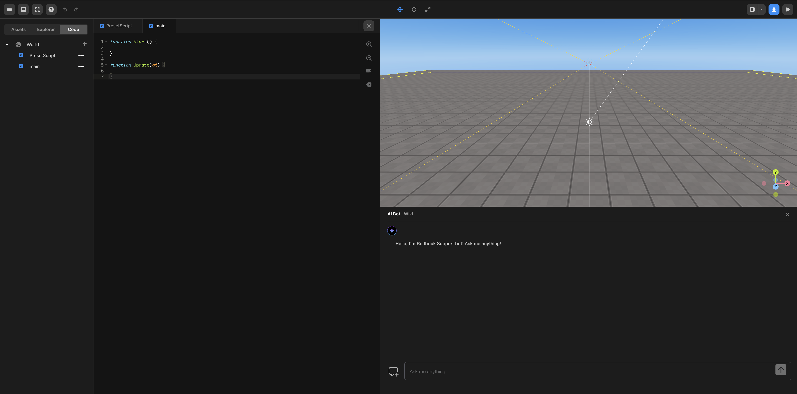

import { Cards } from "nextra/components";

# Text Coding

> Guides for text coding

---

You can implement the behavior of objects by writing scripts in the selected language.

Text coding is written using the `JavaScript`-based Redbrick Text Code API.

 

 Text Coding

